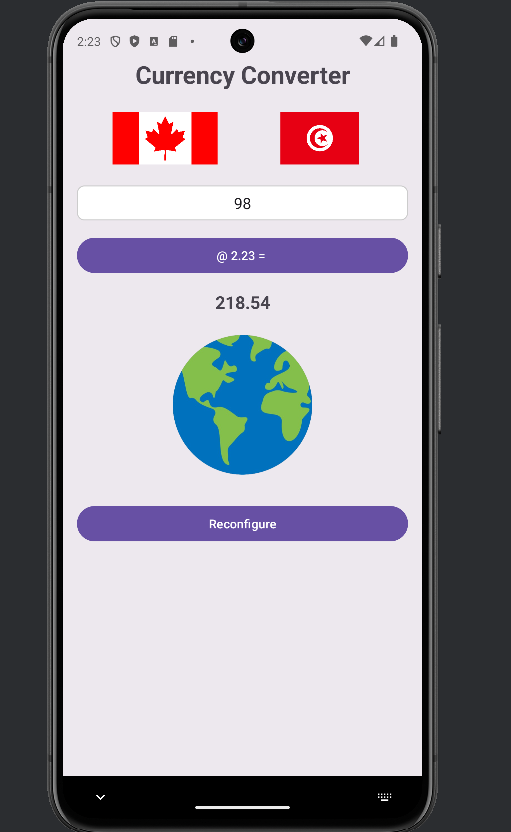
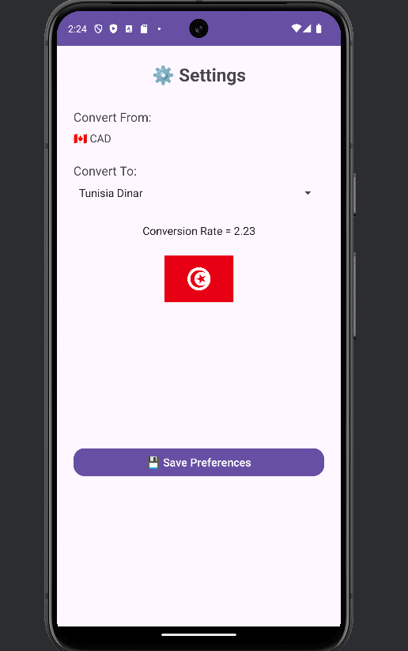

# Currency Converter App

A simple Android application that allows users to convert currency from CAD to various other currencies.

## 📸 Screenshots

### Main Screen

### Settings Screen

## Features

- Convert from 🇨🇦 CAD to selected currencies
- Shows conversion rate
- Displays corresponding country flag
- Save your preferences

## Technologies Used

- Java
- Android Studio
- XML Layouts
- ConstraintLayout
- Material Components
